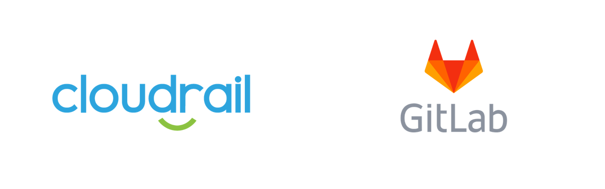

# Cloudrail Estimator - GitLab



The code here is used with GitLab. It requires Python 3.8 and later. It will connect to the GitLab Server API using a private token or oauth (you can use either option, but must use one of them). 

The script will connect to either GitLab.com (if you use that) or your local server, list all projects, find the ones that have IaC in them,
and count how many users have committed to the relevant repositories over the past X days (90 by default).
If the same user contributed to multiple repositories, they will be counted only once. This script
uses the users' email addresses to achieve this behavior. There is no data sent to Indeni/Cloudrail in this script,
it is all executed locally with API calls to the GitLab server.

The output is saved to a CSV file to make it easy to analyze in Excel or a similar application.

NOTE:
If you have many projects accessible to you (which is especially true if you're searching on GitLab.com, as all public 
projects are accessible), use the `--project-search` flag.

## Prerequisites
* python3.8
* venv or virtualenv

## Usage

1. Create a virtual environment

```bash
python -m venv venv
# or, if you prefer using virtualenv
python -m virtualenv -p python3 venv
```

2. Activate the virtual environment

```bash
source venv/bin/activate
```

3. Install the tool requirements
```bash
pip install -r requirements.txt
```

4. [Create a personal access token on GitLab](https://docs.gitlab.com/ee/user/profile/personal_access_tokens.html#create-a-personal-access-token).

- Navigate to your gitlab profile
- In the left sidebar, select **Access Tokens**
- Give the token a name, and choose an expiration date
- Give the token the `read_api` and `read_repository` scopes
- Click the "Create personal access token" button
- Copy the personal access token to your clipboard

5. Export the personal access token to your environment
```bash
export GITLAB_PAT=your_pasted_personal_access_token
```

6. Run the estimator with the following command

```bash
python scan_gitlab.py --private-token $GITLAB_PAT
```

Optional: if you prefer to use an oAuth token, you can do so using the following command

```bash
python scan_gitlab.py --oauth-token something
```

The script will output a CSV with the number of unique contributors for each project scanned. The tool will only scan projects for which you are a member.
